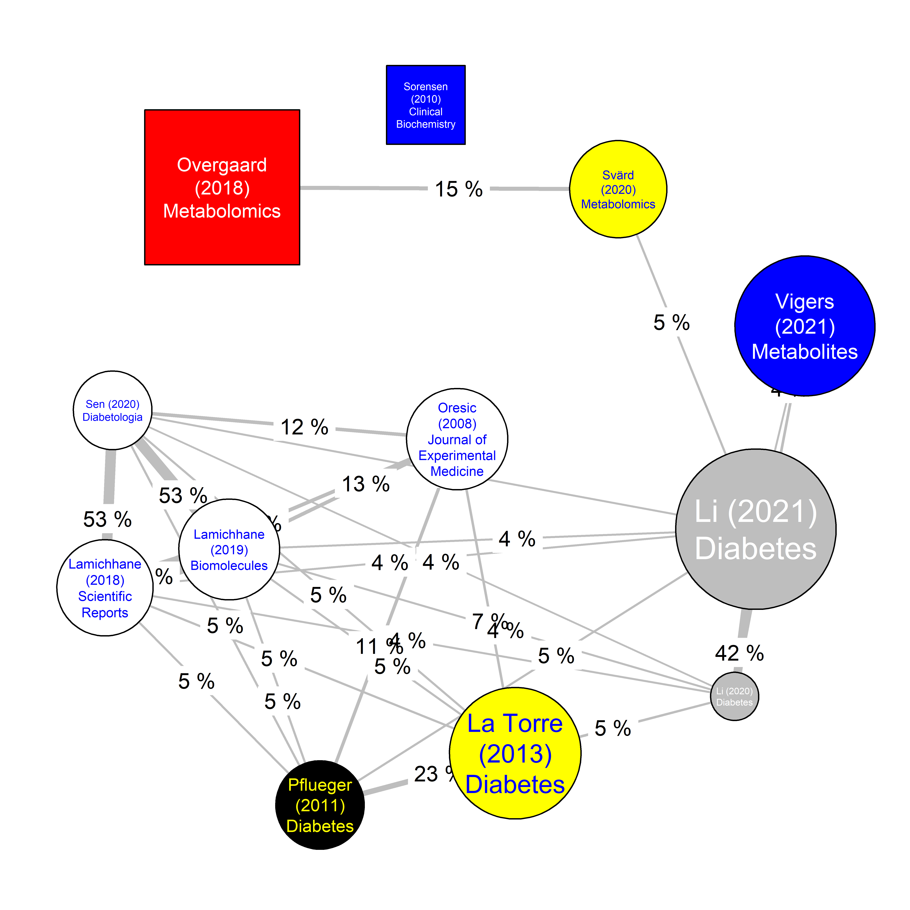
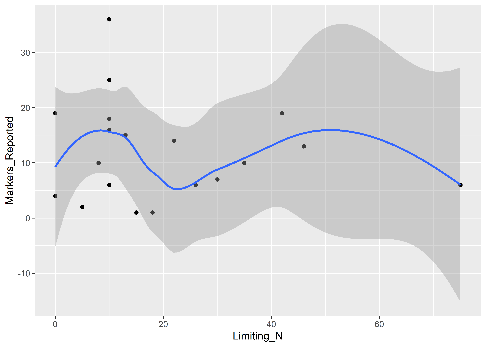

T1D Lipidome
================
Tommi Suvitaival, <tommi.raimo.leo.suvitaival@regionh.dk>, Steno
Diabetes Center Copenhagen
2021-09-21

# Preparations

## Load Data

``` r
data.loaded <-
  read.table(
    file = "data-updated/T1D-lipidome-database-updated.tsv",
    check.names = FALSE,
    header = TRUE,
    na = "",
    sep = "\t",
    stringsAsFactors = FALSE
  )
```

## Create Additional Columns

``` r
data <- tibble::as_tibble( x = data.loaded  )

tmp <-
  apply(
    X = is.na( data ),
    MAR = 1,
    FUN = all
  )

data <- data[ !tmp, ]

data$"Authors.list" <-
  stringr::str_split(
    string = data$"Authors",
    pattern = ", "
  )

data$"Author.Year.Journal" <-
  paste0(
    data$"Author",
    " (",
    data$"Year",
    ") ",
    data$"Journal"
  )

data$"N.Limiting" <-
  apply(
    X = as.matrix( data[ , c( "N Case", "N Control" ) ] ),
    MAR = 1,
    FUN = 
      function( x ) {
        
        tmp <- min( na.omit( x ) )
        
        if ( is.infinite( tmp ) ) {
          
          tmp <- NA
          
        }
        
        return( tmp )
        
      }
  )

data$"Name" <-
  stringr::str_replace(
    string = data$"Name",
    pattern = "Lyso",
    replacement = "L"
  )
```

## Number of Entries

``` r
dim( data[ !is.na( data$"N.Limiting" ), ] )
```

    ## [1] 361  19

``` r
dim( data[ !is.na( data$"N.Limiting" ) & is.na( data$"Time from diagnosis" ), ] )
```

    ## [1] 308  19

``` r
dim( data[ !is.na( data$"N.Limiting" ) & !is.na( data$"Time from diagnosis" ), ] )
```

    ## [1] 53 19

# Progressors to T1D v. Control

``` r
names.compounds <- sort( unique( data$"Name" ) )

data.plot <- data[ data$"Contrast" == "PT1D/CTR", ]

data.plot <- data.plot[ !is.na( data.plot$"Significance" ), ]

age <- c( "Birth", "1 y" )

data.plot <- data.plot[ data.plot$Age %in% age, ]

data.plot.wide <-
  tidyr::pivot_wider(
    data = data.plot,
    names_from = "Name",
    values_from = "Sign"
  )

data.plot.wide <-
  data.plot.wide[ is.na( data.plot.wide$"Comment" ), ]

rownames( data.plot.wide ) <-
  data.plot.wide$"Author.Year.Journal"
```

    ## Warning: Setting row names on a tibble is deprecated.

``` r
cor.papers <-
  cor(
    x = t( data.plot.wide[ , colnames( data.plot.wide ) %in% names.compounds ] ),
    use = "pairwise.complete.obs"
  )

table.paper.by.name <- table( data$"Author.Year.Journal", data$"Name" )

cor.papers <- cor( t( table.paper.by.name ) )

cov.papers <- cov( t( table.paper.by.name ) )
```

# Consensus of Aberrations in the Lipidome Before the Onset of T1D

## Prepare Data

### Map Lipid Names

``` r
data.plot <- data[ data$"Contrast" == "PT1D/CTR", ]

data.plot <- data.plot[ !is.na( data.plot$"Significance" ), ]

names.lipids.unique <- unique( data.plot$"Name" )

names.mapping <- lipidomeR::map_lipid_names( x = names.lipids.unique )

names.mapping[ which( names.mapping$"Class" == "PC-O/" ), "Class" ] <-
  "PC-O/P"
```

### Compute Consensus Aberrations

``` r
data.plot <-
  merge(
    x = data.plot,
    y = names.mapping,
    by = "Name",
    all = TRUE
  )

data.grouped <-
  dplyr::group_by(
    .data = data.plot,
    Name.simple,
    Author.Year.Journal
  )

data.grouped <-
  dplyr::summarise(
    .data = data.grouped,
    Sign.median = median( Sign )
  )
```

    ## `summarise()` has grouped output by 'Name.simple'. You can override using the `.groups` argument.

``` r
data.summed <-
  dplyr::group_by(
    .data = data.grouped,
    Name.simple
  )

data.summed <-
  dplyr::summarise(
    .data = data.summed,
    Consensus_Effect = sum( Sign.median )
  )

data.summed <-
  merge(
    x = data.summed,
    y = names.mapping,
    all.x = TRUE,
    all.y = FALSE
  )
```

## Heatmap of Consensus Aberration in Progression to T1D

``` r
tmp <- c( "Name", "Consensus_Effect" )

tmp2 <- colnames( data.summed )[ !( colnames( data.summed ) %in% tmp ) ]
tmp2 <- c( "Name", tmp2 )

figure <-
  lipidomeR::heatmap_lipidome(
    x = data.summed[ , tmp ],
    names.mapping = data.summed[ , tmp2 ],
    class.facet = "wrap",
    x.names = "Name",
    melt.value.name = "Consensus_Effect",
    fill.limits = 
      c( -1, 1 ) * 
      max( 
        x = abs( data.summed$"Consensus_Effect" ),
        na.rm = TRUE
      ),
    fill.midpoint = 0,
    scales = "free",
    space = "free",
    axis.x.carbons = FALSE
  )
```

    ## Warning: `expand_scale()` is deprecated; use `expansion()` instead.

    ## Warning: `expand_scale()` is deprecated; use `expansion()` instead.

    ## Warning: Removed 121 rows containing missing values (geom_text).

    ## Warning: Removed 121 rows containing missing values (geom_text).

<!-- -->

``` r
# print( figure )

figure.B <-
  figure +
  ggplot2::xlab( 
    label = "Lipid degree of unsaturation\n(number of fatty-acid double bonds)"
  ) +
  ggplot2::ylab(
    label = "Lipid size\n(number of fatty-acid carbon atoms)"
  )

print( figure.B )
```

    ## Warning: Removed 121 rows containing missing values (geom_text).

    ## Warning: Removed 121 rows containing missing values (geom_text).

<!-- -->

## Counts of Consensus-Aberrated Lipids

``` r
tmp <- unique( data.plot$"Name.simple" )

length( tmp ) 
```

    ## [1] 106

``` r
tmp <-
  stringr::str_split_fixed(
    string = tmp,
    pattern = "\\(",
    n = 2
  )

tmp <-
  stringr::str_replace(
    string = tmp[ , 1 ],
    pattern = "O\\/$",
    replacement = "O/P"
  )

table( tmp )
```

    ## tmp
    ##           CE          Cer           DG          LPC          LPE           PC 
    ##            2            3            4            8            1           22 
    ##       PC-O/P           PE           PI Plasmenyl-PC plasmenyl-PE           PS 
    ##           11            2            1            1            3            1 
    ##           SM           TG 
    ##            7           40

``` r
sort( table( tmp ) )
```

    ## tmp
    ##          LPE           PI Plasmenyl-PC           PS           CE           PE 
    ##            1            1            1            1            2            2 
    ##          Cer plasmenyl-PE           DG           SM          LPC       PC-O/P 
    ##            3            3            4            7            8           11 
    ##           PC           TG 
    ##           22           40

``` r
table( data.plot$"Name.simple" )
```

    ## 
    ##                  CE(18:1)                  CE(18:2)                 Cer(40:1) 
    ##                         1                         1                         2 
    ##                 Cer(41:1)                 Cer(42:1)                  DG(32:0) 
    ##                         1                         2                         1 
    ##                  DG(34:1)                  DG(36:2)                  DG(36:3) 
    ##                         1                         1                         1 
    ##                 LPC(16:0)                 LPC(18:0)                 LPC(18:1) 
    ##                         1                         5                         1 
    ##                 LPC(18:2)                 LPC(18:3)                 LPC(20:0) 
    ##                         2                         1                         1 
    ##                 LPC(20:1)                 LPC(20:2)                 LPE(20:1) 
    ##                         1                         1                         1 
    ##               PC-O/(32:0)               PC-O/(32:1)               PC-O/(34:1) 
    ##                         1                         1                         2 
    ##               PC-O/(36:4)               PC-O/(36:5)               PC-O/(38:4) 
    ##                         2                         3                         1 
    ##      PC-O/(38:4)/C(P38:3)               PC-O/(38:5)               PC-O/(40:5) 
    ##                         2                         3                         2 
    ##               PC-O/(40:6)              PC-O/P(38:5)                  PC(28:0) 
    ##                         3                         1                         1 
    ##                  PC(30:0)                  PC(32:1)                  PC(32:2) 
    ##                         2                         2                         2 
    ##                  PC(33:0)                  PC(33:1)                  PC(34:3) 
    ##                         1                         1                         4 
    ##                  PC(35:2)                  PC(35:3)                  PC(36:3) 
    ##                         1                         2                         2 
    ##                  PC(36:4)                  PC(36:5) PC(36:5) and PE-O/P(38:5) 
    ##                         4                         2                         1 
    ##     PC(37:4) and PE(40:4)                  PC(38:2)                  PC(38:3) 
    ##                         1                         1                         1 
    ##                  PC(38:4)                  PC(38:5)                  PC(38:6) 
    ##                         1                         2                         3 
    ##                  PC(38:7)                  PC(40:5)                  PC(40:6) 
    ##                         2                         1                         4 
    ##                  PE(38:2)                  PE(38:4)                  PI(38:4) 
    ##                         1                         1                         1 
    ##        Plasmenyl-PC(38:5)        plasmenyl-PE(36:3)        plasmenyl-PE(36:6) 
    ##                         1                         1                         1 
    ##        plasmenyl-PE(38:5)                  PS(42:8)                  SM(34:1) 
    ##                         1                         1                         1 
    ##                  SM(36:2)                  SM(41:1)                  SM(41:2) 
    ##                         3                         1                         1 
    ##                  SM(42:1)                  SM(42:2)                  SM(43:2) 
    ##                         4                         1                         1 
    ##                  TG(42:0)                  TG(46:1)                  TG(46:2) 
    ##                         1                         2                         2 
    ##                  TG(47:1)                  TG(47:2)                  TG(48:1) 
    ##                         1                         1                         4 
    ##                  TG(48:3)                  TG(49:1)                  TG(50:0) 
    ##                         3                         1                         1 
    ##                  TG(50:1)                  TG(50:3)                  TG(50:4) 
    ##                         2                         6                         3 
    ##                  TG(50:5)                  TG(51:1)                  TG(51:2) 
    ##                         2                         5                         3 
    ##                  TG(51:3)                  TG(51:4)                  TG(52:0) 
    ##                         3                         2                         1 
    ##                  TG(52:1)                  TG(52:3)                  TG(52:4) 
    ##                         4                         4                         6 
    ##                  TG(52:5)                  TG(53:2)                  TG(53:3) 
    ##                         8                         2                         5 
    ##                  TG(54:0)                  TG(54:1)                  TG(54:2) 
    ##                         2                         1                         8 
    ##                  TG(54:3)                  TG(54:4)                  TG(54:5) 
    ##                         5                         1                         3 
    ##                  TG(54:6)                  TG(56:2)                  TG(56:5) 
    ##                         2                         3                         1 
    ##                  TG(56:6)                  TG(56:8)                  TG(58:1) 
    ##                         2                         1                         1 
    ##                  TG(60:1)                 TG(60:11)                  TG(60:2) 
    ##                         1                         1                         2 
    ##                  TG(62:1) 
    ##                         2

``` r
table( table( data.plot$"Name.simple" ) > 1 )
```

    ## 
    ## FALSE  TRUE 
    ##    54    52

``` r
table( table( data.grouped$"Name.simple" ) )
```

    ## 
    ##  1  2  3 
    ## 84 20  2

``` r
tmp <- table( data.grouped$"Name.simple" )

tmp <- tmp[ tmp > 1 ]

length( tmp )
```

    ## [1] 22

# Similarity Network of Publications Based on the Lipidome

## Compute Similarity

``` r
data.plot <-
  data[
    !is.na( data$"Significance" ) &
      ( !is.na( data$"N Case" ) | !is.na( data$"N Control" )
      ),
    ]

data.plot <- data.plot[ !grepl( x = data.plot$"Name", pattern = "Oxidized" ), ]

names.lipids.unique <- unique( data.plot$"Name" )

names.mapping <- lipidomeR::map_lipid_names( x = names.lipids.unique )

names.mapping[ which( names.mapping$"Class" == "PC-O/" ), "Class" ] <-
  "PC-O/P"

data.plot <-
  merge(
    x = data.plot,
    y = names.mapping,
    by = "Name",
    all = TRUE
  )

data.grouped <-
  dplyr::group_by(
    .data = data.plot,
    Name.simple,
    Author.Year.Journal
  )

data.grouped <-
  dplyr::summarise(
    .data = data.grouped,
    Sign.median = median( Sign )
  )
```

    ## `summarise()` has grouped output by 'Name.simple'. You can override using the `.groups` argument.

``` r
data.wide <-
  tidyr::pivot_wider(
    data = data.grouped,
    names_from = "Name.simple",
    values_from = "Sign.median"
  )

data.wide[ is.na( data.wide ) ] <- 0

cor.data <-
  cor(
    x = t( data.wide[ , -1 ] ),
    use = "pairwise.complete.obs",
    method = "spearman"
  )

colnames( cor.data ) <- 
  rownames( cor.data ) <- 
  data.wide$"Author.Year.Journal"

agreement <-
  array( dim = nrow( data.wide ) * c( 1, 1 ) )

rownames( agreement ) <-
  colnames( agreement ) <-
  data.wide$"Author.Year.Journal"

disagreement <-
  jaccard <-
  jaccard.identity <-
  jaccard.disagreement <-
  agreement

jaccard.others <- rep( x = NA, times = nrow( data.wide ) )
names( jaccard.others ) <- rownames( agreement )

for ( i in 1:( nrow( data.wide ) - 1 ) ) {

  tmp.i <- unlist( data.wide[ i, -1 ] )
      
  for ( j in ( i + 1 ):nrow( data.wide ) ) {
    
    tmp.j <- unlist( data.wide[ j, -1 ] )
    
    agreement[ i, j ] <-
      agreement[ j, i ] <-
      sum( 
        tmp.i != 0 &
          sign( tmp.i ) == sign( tmp.j )
      )
    
    disagreement[ i, j ] <-
      disagreement[ j, i ] <-
      sum( 
        tmp.i != 0 &
          tmp.j != 0 &
          sign( tmp.i ) != sign( tmp.j )
      )
    
    jaccard[ i, j ] <-
      jaccard[ j, i ] <-
      sum(
        tmp.i != 0 &
          tmp.j != 0
      ) /
      sum(
        tmp.i != 0 |
          tmp.j != 0
      )
    
    jaccard.identity[ i, j ] <-
      jaccard.identity[ j, i ] <-
      sum(
        tmp.i != 0 &
          sign( tmp.i ) == sign( tmp.j )
      ) /
      sum(
        tmp.i != 0 |
          tmp.j != 0
      )
    
    jaccard.disagreement[ i, j ] <-
      jaccard.disagreement[ j, i ] <-
      sum(
        tmp.i != 0 &
          tmp.j != 0 &
          sign( tmp.i ) != sign( tmp.j )
      ) /
      sum(
        tmp.i != 0 |
          tmp.j != 0
      )
    
  }
    
}

for ( i in 1:nrow( data.wide ) ) {
  
  tmp.i <- unlist( data.wide[ i, -1 ] )
      
  jaccard.others[ i ] <-
    sum(
      tmp.i !=0 &
        apply(
          X = data.wide[ -i, -1 ] != 0,
          MAR = 2,
          FUN = any
        )
    ) /
    sum(
      apply(
        X = data.wide[ , -1 ] != 0,
        MAR = 2,
        FUN = any
      )
    )
  
}
```

## Network Figure

``` r
is.post.diagnosis <- 
  !is.na(
    unlist( data[ 
      match( 
        x = rownames( cor.data ),
        table = data$"Author.Year.Journal"
      ),
      "Time from diagnosis"
      ]
    )
  )

names( is.post.diagnosis ) <- rownames( cor.data )

is.multiple.testing.corrected <-
    grepl(
      x = 
        unlist( data[ 
          match( 
            x = rownames( cor.data ),
            table = data$"Author.Year.Journal"
          ),
          "Significance"
          ]
        ),
      pattern = "adj"
  )

names( is.multiple.testing.corrected ) <- rownames( cor.data )

edge.labels <- as.character( round( x = jaccard.identity * 100 ) )

tmp <- as.character( round( x = jaccard.disagreement* 100 ) )

edge.labels <-
  paste(
    edge.labels,
    tmp,
    sep =","
  )

edge.labels[ edge.labels == "NA; NA" ] <- NA

edge.labels <- array( data = edge.labels, dim = dim( jaccard.identity ) )

jaccard.with.sign <- jaccard

tmp <- jaccard.disagreement > jaccard.identity
jaccard.with.sign[ which( tmp ) ] <- jaccard.with.sign[ which( tmp ) ] * -1

labels <-
  stringr::str_wrap(
    string = colnames( jaccard.with.sign ),
    width = 10
  )
```

-   Nodes: Studies
-   Edge width: Similarity in reported lipids between two studies
-   Edge label: Agreement and disagreement in the sign of the aberration
    of the lipids (first value: agreement; second value: disagreement)
-   Edge color: Majority of agreement (red) or disagreement (blue) in
    the sign of aberration
-   Node size: Average similarity to the other studies
-   Node shape: Pre-onset or post-onset study (circle: pre-onset;
    square: post-onset)
-   Node color: Reported significances corrected for multiple testing
    (gray) or not corrected (white)

``` r
qgraph::qgraph(
  input = jaccard.with.sign,
  diag = FALSE,
  layout = "spring",
  posCol = "red",
  negCol = "blue",
  edge.labels = edge.labels,
  edge.label.margin = 0.02,
  color = 
    ifelse(
      test = is.multiple.testing.corrected,
      yes = "gray",
      no = "white"
    ),
  shape =
    ifelse(
      test = is.post.diagnosis,
      yes = "rectangle",
      no = "circle"
    ),
  labels = labels,
  vsize = 10 * sqrt( jaccard.others ) + 10,
  mar = c( 1, 1, 1, 1 ) * 2
)
```

<!-- -->

``` r
summary( abs( c( jaccard.with.sign ) ) )
```

    ##    Min. 1st Qu.  Median    Mean 3rd Qu.    Max.    NA's 
    ## 0.00000 0.00000 0.00000 0.02598 0.04082 0.22222      12

``` r
rowMeans(
  x = abs( jaccard.with.sign ),
  na.rm = TRUE
)
```

    ##                  Overgaard (2018) Metabolomics 
    ##                                    0.024122178 
    ##                        Sen (2020) Diabetologia 
    ##                                    0.034684389 
    ##                 Lamichhane (2019) Biomolecules 
    ##                                    0.015505999 
    ##          Sorensen (2010) Clinical Biochemistry 
    ##                                    0.031446538 
    ## Oresic (2008) Journal of Experimental Medicine 
    ##                                    0.055569665 
    ##                       Pflueger (2011) Diabetes 
    ##                                    0.035497261 
    ##                             Li (2021) Diabetes 
    ##                                    0.020441919 
    ##                      Svärd (2020) Metabolomics 
    ##                                    0.038095238 
    ##                      Vigers (2021) Metabolites 
    ##                                    0.002272727 
    ##                             Li (2020) Diabetes 
    ##                                    0.014413373 
    ##                       La Torre (2013) Diabetes 
    ##                                    0.015523716 
    ##           Lamichhane (2018) Scientific Reports 
    ##                                    0.024154589

# Summary Table of Lipid Classes

``` r
data.table <- 
  data.plot[ 
    !is.na( data.plot$"N Case" ) |
      !is.na( data.plot$"N Control" ),
    ]

res <-
  by(
    data = data.table,
    INDICES = data.table$"Class",
    FUN =
      function( x ) {
        tmp <- table( x$"Name.simple", x$"Author.Year.Journal" )
        tmp2 <- apply( X = tmp > 0, MAR = 1, FUN = sum )
        
        tmp3 <- which( tmp2 == max( x = tmp2, na.rm = TRUE ) )
        
        if ( length( tmp3 ) > 1 ) {
          tmp4 <- median( x = x[ tmp3, "N.double.bonds" ], na.rm = TRUE )
          tmp5 <- median( x = x[ tmp3, "N.carbons" ], na.rm = TRUE )

          tmp3 <-
            tmp3[
              which.min(
                ( x[ tmp3, "N.double.bonds" ] - tmp4 )^2 +
                  ( x[ tmp3, "N.carbons" ] - tmp5 )^2
              )
              ]

        }
          
        tmp4 <- which( x$"Name.simple" %in% names( tmp2 )[ tmp3 ] )[ 1 ]
        
        return(
          data.frame(
            x[ tmp4, ]
          )
        )
          
      }
  )

res <- dplyr::bind_rows(
  lapply(
    X = res,
    FUN = unlist
  ),
  .id = "Lipid_Class"
)

# res <- dplyr::bind_rows(
#   res,
#   .id = "Lipid_Class"
# )

tmp <- 
  tapply(
    X = data.table$"Name.simple",
    INDEX = data.table$"Class",
    FUN =
      function( x ) {
        length( unique( x ) )
      }
  )

res$"N.unique" <- tmp[ match( x = names( tmp ), table = res$"Class" ) ]

# View( data.table[ data.table$"Name.simple" %in% res$"Name.simple", ] )
```

``` r
res$"Lipid.Class.Name" <-
  c(
    "Cholesterol-ester",
    "Ceramide",
    "Diacylglycerol",
    "Lyso-phosphatidylcholine",
    "Lyso-phosphatidylethanolamine",
    "Phosphatidylcholine",
    "Alkyl-acyl PC",
    "Phosphatidylethanolamine",
    "Alkyl-acyl PE",
    "Phosphatidylinositol",
    "Plasmenyl-PC",
    "Plasmenyl-PE",
    "Phosphatidylserine",
    "Sphingomyelin",
    "Triacylglycerol"
  )

# res$"Lipid.Class.Name" <-
#   c(
#     "Cholesterol-ester",
#     "Ceramide",
#     "Diacylglycerol",
#     "Lyso-phosphatidylcholine",
#     "Lyso-phosphatidylethanolamine",
#     "Phosphatidylcholine",
#     "Alkyl-acyl PC",
#     "Phosphatidylethanolamine",
#     "Alkyl-acyl PE",
#     "Phosphatidylinositol",
#     "Sphingomyelin",
#     "Triacylglycerol"
#   )

names.columns <- 
  c(
    "Class",
    "Lipid.Class.Name",
    "N.unique",
    "Name.simple"
  )

lipid.classes.table <- res[ , names.columns ]

colnames( lipid.classes.table ) <-
  c(
    "Class abbreviation",
    "Class name",
    "Number of unique species in review",
    "Example species"
  )

# knitr::kable( x = lipid.classes.table )
# knitr::kable( x = tibble::as_tibble( lipid.classes.table ) )

write.table(
  x = lipid.classes.table,
  file = "results-updated/Lipid_Classes.tsv",
  row.names = FALSE,
  sep = "\t"
)
```

# Heatmap of Lipids by Publication

``` r
data.heatmap <- as.matrix( data.wide[ , -1 ] )

rownames( data.heatmap ) <- data.wide$"Author.Year.Journal"

rownames( data.heatmap ) <-
  stringr::str_replace(
    string = rownames( data.heatmap ),
    pattern = " ",
    replacement = "\n"
  )

rownames( data.heatmap ) <-
  stringr::str_replace(
    string = rownames( data.heatmap ),
    pattern = " ",
    replacement = "    \n"
  )

rownames( data.heatmap ) <-
  stringr::str_replace(
    string = rownames( data.heatmap ),
    pattern = "\\\n",
    replacement = "        \n"
  )

rownames( data.heatmap ) <-
  stringr::str_replace(
    string = rownames( data.heatmap ),
    pattern = "La        \\\nTorre    \n(2013)",
    replacement = "La Torre        \n(2013)    \n"
  )

rownames( data.heatmap ) <-
  stringr::str_replace(
    string = rownames( data.heatmap ),
    pattern = "Oresic        \\\n\\(2008\\)    \\nJournal of ",
    replacement = "Oresic (2008)        \nJournal of    \n"
  )

colnames( data.heatmap ) <-
  stringr::str_replace(
    string = colnames( data.heatmap ),
    pattern = "O\\/\\(",
    replacement = "O/P("
    
  )

result.heatmap <-
  gplots::heatmap.2(
    x = t( data.heatmap ),
    col = gplots::bluered( n = 3 ),
    trace = "none",
    tracecol = "black",
    srtCol = 45,
    cexCol = 0.2 + 1/log10( nrow( data.heatmap ) ) - 0.5,
    margins = c( 1, 1 ) * 6,
    key.title = "Sign of Effect",
    offsetRow = 0,
    offsetCol = 0,
  )
```

<!-- -->

## Heatmap of Lipids Reported in More than One Study

``` r
data.heatmap.min2 <- data.heatmap[ , colSums( data.heatmap != 0 ) > 1 ]

result.heatmap <-
  gplots::heatmap.2(
    x = t( data.heatmap.min2 ),
    col = gplots::bluered( n = 3 ),
    trace = "none",
    tracecol = "black",
    srtCol = 45,
    cexCol = 0.2 + 1/log10( nrow( data.heatmap.min2 ) ) - 0.5,
    margins = c( 1, 1 ) * 6,
    key.title = "Sign of Effect",
    offsetRow = 0,
    offsetCol = 0,
  )
```

<!-- -->

## Counts by Lipid Class

``` r
dim( data.heatmap.min2 )
```

    ## [1] 12 42

``` r
tmp <-
  stringr::str_split_fixed(
    string = colnames( data.heatmap.min2 ),
    pattern = "\\(",
    n = 2
  )

sort( table( tmp[ , 1 ] ) )
```

    ## 
    ##    Cer     SM     CE     DG PC-O/P    LPC     PC     TG 
    ##      1      1      2      2      3      5     10     18

``` r
# View( t( data.heatmap.min2[ , order( colSums( data.heatmap.min2 != 0 ), decreasing = TRUE ) ] ) )

data.clustered <-
  t( data.heatmap.min2[ result.heatmap$"colInd", result.heatmap$"rowInd" ] )

data.clustered <- data.clustered[ nrow( data.clustered ):1, ]

data.clustered <- data.clustered[ rowSums( data.clustered != 0 ) > 1, ]

names.clusters <- 
  publications.clusters <-
  signs.clusters <-
  list()

for ( i in 1:nrow( data.clustered ) ) {
  
  tmp.i <- names( which( data.clustered[ i, ] != 0 ) )
  
  if ( i == 1 ) {

    names.clusters[[ 1 ]] <- rownames( data.clustered )[ 1 ]
    
    publications.clusters[[ 1 ]] <- tmp.i
    
    signs.clusters[[ 1 ]] <- data.clustered[ 1, ]
        
  } else {
    
    k <- length( names.clusters )
      
    if (
      all(
        data.clustered[ i, ] ==
        signs.clusters[[ k ]] )
    ) {
    
      names.clusters[[ k ]] <- 
        c(
          names.clusters[[ k ]],
          rownames( data.clustered )[ i ]
        )
      
    } else {
      
      names.clusters[[ k+1 ]] <- rownames( data.clustered )[ i ]
      publications.clusters[[ k+1 ]] <- tmp.i
      signs.clusters[[ k+1 ]] <- data.clustered[ i, ]
      
    }
      
  }
  
}

names.clusters <-
  lapply(
    X = names.clusters,
    FUN = sort,
    decreasing = FALSE
  )

signs.clusters.mat <- simplify2array( x = signs.clusters )

signs.clusters.mat <- 
  signs.clusters.mat[ rowSums( signs.clusters.mat !=0 ) > 0, ] 

order.clusters <-
  order( colSums( signs.clusters.mat != 0 ), decreasing = TRUE )

order.clusters <- 1:ncol( signs.clusters.mat )

mode( signs.clusters.mat ) <- "character"

signs.clusters.mat[ signs.clusters.mat == "-1" ] <- "-"
signs.clusters.mat[ signs.clusters.mat == "1" ] <- "+"
signs.clusters.mat[ signs.clusters.mat == "0" ] <- ""

clusters <-
  data.frame(
    t( signs.clusters.mat ),
    check.names = FALSE
  )

clusters.printed <- 
  data.frame(
    Lipids = 
      sapply(
        X = names.clusters,
        FUN = paste,
        collapse = ", "
      ),
    clusters,
    check.names = FALSE
)

clusters.printed <- clusters.printed[ order.clusters, ]
    
colnames( clusters.printed )[ -1 ]
```

    ##  [1] "Oresic (2008)        \nJournal of    \nExperimental Medicine"
    ##  [2] "Sen        \n(2020)    \nDiabetologia"                       
    ##  [3] "Overgaard        \n(2018)    \nMetabolomics"                 
    ##  [4] "Li        \n(2021)    \nDiabetes"                            
    ##  [5] "Li        \n(2020)    \nDiabetes"                            
    ##  [6] "Lamichhane        \n(2018)    \nScientific Reports"          
    ##  [7] "La        \nTorre    \n(2013) Diabetes"                      
    ##  [8] "Vigers        \n(2021)    \nMetabolites"                     
    ##  [9] "Lamichhane        \n(2019)    \nBiomolecules"                
    ## [10] "Svärd        \n(2020)    \nMetabolomics"                     
    ## [11] "Sorensen        \n(2010)    \nClinical Biochemistry"         
    ## [12] "Pflueger        \n(2011)    \nDiabetes"

``` r
colnames( clusters.printed ) <-
  stringr::str_replace_all(
    string = colnames( clusters.printed ),
    pattern = "\\s+\\n",
    replacement = " "
  )

colnames( clusters.printed )[ -1 ] <-
  paste(
    LETTERS[ 1:( ncol( clusters.printed ) - 1 ) ],
    colnames( clusters.printed[ -1 ] )
  )

clusters.printed$"Total" <- rowSums( clusters.printed[ , -1 ] != "" )

# View( x = clusters.printed )
# knitr::kable( x = clusters.printed )
knitr::kable( x = tibble::as_tibble( clusters.printed ) )
```

| Lipids                                                                    | A Oresic (2008) Journal of Experimental Medicine | B Sen (2020) Diabetologia | C Overgaard (2018) Metabolomics | D Li (2021) Diabetes | E Li (2020) Diabetes | F Lamichhane (2018) Scientific Reports | G La Torre (2013) Diabetes | H Vigers (2021) Metabolites | I Lamichhane (2019) Biomolecules | J Svärd (2020) Metabolomics | K Sorensen (2010) Clinical Biochemistry | L Pflueger (2011) Diabetes | Total |
|:--------------------------------------------------------------------------|:-------------------------------------------------|:--------------------------|:--------------------------------|:---------------------|:---------------------|:---------------------------------------|:---------------------------|:----------------------------|:---------------------------------|:----------------------------|:----------------------------------------|:---------------------------|------:|
| LPC(18:3)                                                                 | \+                                               |                           |                                 |                      |                      |                                        |                            |                             |                                  |                             | \+                                      | \+                         |     3 |
| TG(56:2)                                                                  |                                                  |                           |                                 |                      | \-                   |                                        |                            |                             |                                  |                             | \+                                      |                            |     2 |
| LPC(16:0), LPC(18:1)                                                      |                                                  |                           |                                 | \-                   |                      |                                        |                            |                             |                                  | \+                          |                                         |                            |     2 |
| LPC(18:0)                                                                 | \+                                               |                           |                                 | \-                   |                      |                                        |                            |                             |                                  |                             |                                         |                            |     2 |
| PC(33:1)                                                                  |                                                  |                           |                                 |                      | \-                   |                                        |                            |                             |                                  | \+                          |                                         |                            |     2 |
| PC(33:0)                                                                  |                                                  |                           |                                 |                      |                      | \-                                     |                            |                             |                                  | \+                          |                                         |                            |     2 |
| SM(36:2)                                                                  |                                                  |                           |                                 |                      | \-                   | \-                                     |                            |                             |                                  |                             |                                         |                            |     2 |
| TG(56:5)                                                                  |                                                  |                           |                                 |                      |                      | \+                                     |                            |                             |                                  | \-                          |                                         |                            |     2 |
| PC(38:5)                                                                  |                                                  |                           |                                 |                      |                      |                                        |                            |                             |                                  | \-                          |                                         | \+                         |     2 |
| TG(51:3)                                                                  |                                                  | \-                        |                                 |                      |                      |                                        |                            |                             | \+                               |                             |                                         |                            |     2 |
| PC(30:0)                                                                  |                                                  | \-                        |                                 |                      |                      |                                        |                            |                             |                                  |                             | \+                                      |                            |     2 |
| PC(36:3)                                                                  |                                                  | \-                        |                                 |                      | \-                   |                                        |                            |                             |                                  |                             |                                         |                            |     2 |
| TG(50:2)                                                                  |                                                  |                           | \-                              |                      |                      |                                        |                            |                             |                                  |                             |                                         | \+                         |     2 |
| CE(18:2)                                                                  |                                                  |                           | \-                              |                      |                      |                                        |                            |                             | \+                               |                             |                                         |                            |     2 |
| DG(34:1), DG(36:2), LPC(20:2)                                             |                                                  |                           | \-                              | \-                   |                      |                                        |                            |                             |                                  |                             |                                         |                            |     2 |
| TG(52:3), TG(52:4)                                                        | \-                                               |                           | \-                              |                      |                      |                                        |                            |                             |                                  |                             |                                         |                            |     2 |
| TG(50:3)                                                                  | \-                                               | \-                        | \-                              |                      |                      |                                        |                            |                             |                                  |                             |                                         |                            |     3 |
| CE(18:1), TG(48:3)                                                        |                                                  | \-                        | \-                              |                      |                      |                                        |                            |                             |                                  |                             |                                         |                            |     2 |
| PC(36:4)                                                                  | \-                                               | \-                        |                                 |                      |                      |                                        | \-                         |                             |                                  |                             | \+                                      | \+                         |     5 |
| TG(46:1)                                                                  | \-                                               |                           |                                 |                      |                      |                                        |                            |                             | \-                               |                             | \+                                      |                            |     3 |
| TG(46:2), TG(48:1)                                                        | \-                                               |                           |                                 |                      |                      |                                        |                            |                             | \-                               |                             |                                         |                            |     2 |
| PC(36:5)                                                                  | \-                                               |                           |                                 |                      |                      |                                        |                            |                             |                                  |                             | \+                                      | \+                         |     3 |
| PC(32:2)                                                                  | \-                                               |                           |                                 |                      |                      |                                        |                            |                             |                                  |                             | \+                                      |                            |     2 |
| PC(38:6)                                                                  | \-                                               |                           |                                 |                      |                      |                                        | \-                         |                             |                                  |                             |                                         |                            |     2 |
| PC-O/P(32:1)                                                              | \-                                               |                           |                                 |                      |                      |                                        |                            | \+                          |                                  |                             |                                         |                            |     2 |
| PC-O/P(36:4), TG(53:3)                                                    | \-                                               |                           |                                 |                      | \-                   |                                        |                            |                             |                                  |                             |                                         |                            |     2 |
| PC(34:3)                                                                  | \-                                               |                           |                                 |                      |                      |                                        |                            |                             |                                  |                             |                                         | \+                         |     2 |
| TG(50:1)                                                                  | \-                                               | \-                        |                                 |                      |                      |                                        |                            |                             |                                  |                             |                                         | \+                         |     3 |
| Cer(40:1), PC-O/P(38:5), TG(51:1), TG(52:5), TG(54:2), TG(54:3), TG(54:5) | \-                                               | \-                        |                                 |                      |                      |                                        |                            |                             |                                  |                             |                                         |                            |     2 |

``` r
write.table(
  x = clusters.printed,
  file = "results-updated/Lipids_by_Publication.tsv",
  row.names = FALSE,
  sep = "\t"
)
```

# Similarity Network of Publications Based on the Author List

-   Node size: Limiting sample size in the study
-   Node color: Country of the cohort
-   Edge width: Similarity in the author list (%)

``` r
data.authors <-
  data[
    match(
      x = rownames( jaccard ),
      table = data$"Author.Year.Journal"
    ), ]

color <-
  factor(
    x = data.authors$"Population",
    levels = sort( unique( data.authors$"Population" ) ),
    labels = c( "red", "white", "gray", "black", "yellow", "blue" )
  )

color.labels <-
  factor(
    x = color,
    labels = c( "white", "blue", "white", "yellow", "blue", "white" )
  )

size.nodes <-
  tapply(
    X = 
      apply(
        X = as.matrix( data[ , c( "N Case", "N Control" ) ] ),
        MAR = 1,
        FUN = 
          function( x ) {
            
            tmp <- min( na.omit( x ) )
            
            if ( is.infinite( tmp ) ) {
              
              tmp <- NA
              
            }
            
            return( tmp )
            
          }
      ),
    INDEX = data$"Author.Year.Journal",
    FUN = median,
    na.rm = TRUE
  )

size.nodes <- size.nodes[ data.authors$"Author.Year.Journal" ]

jaccard.authors <- array( dim = nrow( data.authors ) * c( 1, 1 ) )

for ( i in 1:( nrow( data.authors ) - 1 ) ) {
  
  for ( j in ( i + 1 ):nrow( data.authors ) ) {
  
    jaccard.authors[ i, j ] <-
      jaccard.authors[ j, i ] <-
      sum(
        data.authors$"Authors.list"[[ i ]] %in% 
          data.authors$"Authors.list"[[ j ]]
      ) / 
      length( 
        unique(
          c(
            data.authors$"Authors.list"[[ i ]],
            data.authors$"Authors.list"[[ j ]]
          )
        )
      )

  }
      
}

rownames( jaccard.authors ) <-
  colnames( jaccard.authors ) <-
  data.authors$"Author.Year.Journal"

independence.authors <- NULL

for ( i in 1:nrow( data.authors ) ) {
  
  independence.authors[ i ] <- 
    1 -
    sum(
      data.authors$"Authors.list"[[ i ]] %in% 
        unique( unlist( data.authors[ -i, "Authors.list" ] ) )
    ) / 
    length( data.authors$"Authors.list"[[ i ]] )

}

names( independence.authors ) <- data.authors$"Author.Year.Journal"

edge.labels <- as.character( round( x = jaccard.authors * 100 ) )

edge.labels <-
  paste(
    edge.labels,
    "%"
  )

edge.labels[ edge.labels == "NA %" ] <- NA

edge.labels <- array( data = edge.labels, dim = dim( jaccard.authors ) )

qgraph::qgraph(
  input = jaccard.authors,
  diag = FALSE,
  layout = "spring",
  posCol = "gray",
  edge.labels = edge.labels,
  edge.label.margin = 0.02,
  edge.label.color = "black",
  fade = FALSE,
  shape = 
    ifelse(
      test = is.post.diagnosis,
      yes = "rectangle",
      no = "circle"
    ),
  label.color = as.character( color.labels ),
  color = as.character( color ),
  labels = labels,
  vsize = sqrt( size.nodes ) + 5
)
```

<!-- -->

# Summary of Studies

``` r
data.table1 <- data[ !is.na( data$"N.Limiting" ), ]

data.table1$"N.Limiting.Median" <-
  apply(
    X = data.table1,
    MAR = 1,
    FUN =
      function( x ) {
        tmp <-
          which( data.table1$"Author.Year.Journal" == x$"Author.Year.Journal" )
        median(
          x = unlist( data.table1[ tmp, "N.Limiting" ] ),
          na.rm = TRUE
        )
      }
  )

data.table1$"N.Lipids.Reported" <-
  apply(
    X = data.table1,
    MAR = 1,
    FUN =
      function( x ) {
        tmp <-
          which( data.table1$"Author.Year.Journal" == x$"Author.Year.Journal" )
        length(
          unique(
            unlist( data.table1[ tmp, "Name" ] )
          )
        )
      }
  )

data.table1 <-
  by(
    data = data.table1,
    INDICES = data.table1$"Author.Year.Journal",
    FUN = function( x ) {
      apply(
        X = x,
        MAR = 2,
        FUN =
          function( x ) {
            
            y <- unique( x )
            
            y <- sort( unlist( y ) )
            
            y <-
              paste(
                y,
                collapse = ", "
              )
              
            return( y )
            
          }
      )
    }
  )

table1 <- t( simplify2array( x = data.table1, higher = FALSE ) )
```

``` r
names.included <-
  c(
    "Author.Year.Journal",
    "Population",
    "Age",
    "Time from diagnosis",
    "Contrast",
    "N.Limiting.Median",
    "Source",
    "N.Lipids.Reported"
  )

table1.printed <-
  table1[ , names.included ]

table1.printed <-
  as.data.frame(
    table1.printed,
    check.names = FALSE,
    stringsAsFactors = FALSE
  )

table1.printed$"Independence" <-
  round( 
    x = independence.authors[ table1.printed$"Author.Year.Journal" ] * 100
  )

colnames( table1.printed ) <-
  c(
    "Study",
    "Country",
    "Age",
    "Time from diagnosis",
    "Contrast",
    "Limiting sample size (median)",
    "Source of results",
    "Number of associated lipids reported",
    "Independence from other studies (%)"
  )

table1.printed[ table1.printed == "NA" ] <- "-"

# View( table1.printed )
# knitr::kable( table1.printed )
# knitr::kable( tibble::as_tibble( table1.printed ) )

# print(
#   x = tibble::as_tibble( table1.printed ),
#   n = Inf
#   # ,
#   # width = Inf
# )

write.table(
  x = table1.printed,
  file = "results-updated/Summary-Publications.tsv",
  row.names = FALSE,
  sep = "\t"
)
```

# Number of Reported Lipids by Sample Size

``` r
data.plot <- data[ !is.na( data$"N.Limiting" ), ]

data.plot[ is.na( data.plot$"Age" ), "Age" ] <- "NA"

data.plot$"Time from diagnosis.filled" <- data.plot$"Time from diagnosis"

data.plot[ 
  is.na( data.plot$"Time from diagnosis.filled" ),
  "Time from diagnosis.filled"
  ] <- "NA"

data.plot$"Paper.Contrast.Age.Time" <-
  paste(
    data.plot$"Author.Year.Journal",
    data.plot$"Contrast",
    data.plot$"Age",
    data.plot$"Time from diagnosis.filled"
  )

data.plot.summary <- 
  by(
    data = data.plot,
    INDICES = data.plot$"Paper.Contrast.Age.Time",
    FUN = function( x ) {
      c(
        x[ 1, "Author.Year.Journal" ],
        x[ which( !is.na( x$"Significance" ) )[ 1 ], "Significance" ],
        any( !is.na( x$"Time from diagnosis" ) ),
        length( which( !is.na( x$"Significance" ) ) ),
        median( x$"N.Limiting", na.rm = TRUE )
      )
    }
  )

data.plot.summary <- t( simplify2array( x = data.plot.summary ) )

data.plot.summary <- 
  data.frame( 
    data.plot.summary,
    stringsAsFactors = FALSE
    )

colnames( data.plot.summary ) <-
  c(
    "Author.Year.Journal",
    "Significance",
    "is_post_diagnosis",
    "Markers_Reported",
    "Limiting_N"
  )

data.plot.summary$"is_multiple_testing_corrected" <- 
  grepl(
    x = data.plot.summary$"Significance",
    pattern = "adj"
  )

data.plot.summary$"Markers_Reported" <- 
  as.numeric( data.plot.summary$"Markers_Reported" )

data.plot.summary$"Limiting_N" <- as.numeric( data.plot.summary$"Limiting_N" )

data.plot.summary$"is_post_diagnosis" <- 
  unlist( data.plot.summary$"is_post_diagnosis" )

data.plot.summary$"is_multiple_testing_corrected_and_is_post_diagnosis" <-
  paste(
    data.plot.summary$"is_multiple_testing_corrected",
    data.plot.summary$"is_post_diagnosis"
  )

ggplot2::ggplot(
  data = data.plot.summary,
  mapping =
    ggplot2::aes(
      x = Limiting_N,
      y = Markers_Reported,
      color = is_multiple_testing_corrected_and_is_post_diagnosis
    )
) +
  ggplot2::geom_point() +
  ggplot2::geom_smooth( method = "lm", se = FALSE )
```

<!-- -->

``` r
data.plot.summary.pre <-
  data.plot.summary[
    data.plot.summary$"is_post_diagnosis" == FALSE &
      data.plot.summary$is_multiple_testing_corrected == FALSE,
  ]

ggplot2::ggplot(
  data = data.plot.summary.pre,
  mapping =
    ggplot2::aes(
      x = Limiting_N,
      y = Markers_Reported
    )
) +
  ggplot2::geom_point() +
  ggplot2::geom_smooth( method = "auto", se = TRUE )
```

<!-- -->

# Appendix

``` r
utils::sessionInfo()
```

    ## R version 4.0.4 (2021-02-15)
    ## Platform: x86_64-w64-mingw32/x64 (64-bit)
    ## Running under: Windows 10 x64 (build 19042)
    ## 
    ## Matrix products: default
    ## 
    ## locale:
    ## [1] LC_COLLATE=English_United States.1252 
    ## [2] LC_CTYPE=English_United States.1252   
    ## [3] LC_MONETARY=English_United States.1252
    ## [4] LC_NUMERIC=C                          
    ## [5] LC_TIME=English_United States.1252    
    ## 
    ## attached base packages:
    ## [1] stats     graphics  grDevices utils     datasets  methods   base     
    ## 
    ## loaded via a namespace (and not attached):
    ##  [1] tidyr_1.1.2         splines_4.0.4       tmvnsim_1.0-2      
    ##  [4] gtools_3.8.2        Formula_1.2-4       shadowtext_0.0.7   
    ##  [7] BiocManager_1.30.10 highr_0.8           stats4_4.0.4       
    ## [10] latticeExtra_0.6-29 lipidomeR_0.1.2     yaml_2.2.1         
    ## [13] pbivnorm_0.6.0      pillar_1.5.0        backports_1.2.1    
    ## [16] lattice_0.20-41     glue_1.4.2          limma_3.46.0       
    ## [19] digest_0.6.27       RColorBrewer_1.1-2  checkmate_2.0.0    
    ## [22] colorspace_2.0-0    htmltools_0.5.1.1   Matrix_1.3-2       
    ## [25] survey_4.0          plyr_1.8.6          psych_2.0.12       
    ## [28] pkgconfig_2.0.3     purrr_0.3.4         corpcor_1.6.9      
    ## [31] scales_1.1.1        glasso_1.11         jpeg_0.1-8.1       
    ## [34] fdrtool_1.2.16      htmlTable_2.1.0     tibble_3.0.6       
    ## [37] mgcv_1.8-33         generics_0.1.0      farver_2.0.3       
    ## [40] ggplot2_3.3.3       ellipsis_0.3.1      pbapply_1.4-3      
    ## [43] nnet_7.3-15         mnormt_2.0.2        survival_3.2-7     
    ## [46] magrittr_2.0.1      crayon_1.4.1        evaluate_0.14      
    ## [49] fansi_0.4.2         gplots_3.1.1        nlme_3.1-152       
    ## [52] foreign_0.8-81      tableone_0.12.0     tools_4.0.4        
    ## [55] data.table_1.13.6   mitools_2.4         lifecycle_1.0.0    
    ## [58] stringr_1.4.0       munsell_0.5.0       cluster_2.1.0      
    ## [61] compiler_4.0.4      caTools_1.18.1      rlang_0.4.11       
    ## [64] grid_4.0.4          rstudioapi_0.13     htmlwidgets_1.5.3  
    ## [67] igraph_1.2.6        bitops_1.0-6        lavaan_0.6-7       
    ## [70] base64enc_0.1-3     labeling_0.4.2      rmarkdown_2.7      
    ## [73] gtable_0.3.0        abind_1.4-5         DBI_1.1.1          
    ## [76] reshape2_1.4.4      qgraph_1.6.9        R6_2.5.0           
    ## [79] gridExtra_2.3       knitr_1.31          dplyr_1.0.4        
    ## [82] utf8_1.1.4          Hmisc_4.5-0         KernSmooth_2.23-18 
    ## [85] stringi_1.5.3       parallel_4.0.4      Rcpp_1.0.6         
    ## [88] vctrs_0.3.6         rpart_4.1-15        png_0.1-7          
    ## [91] tidyselect_1.1.0    xfun_0.21
